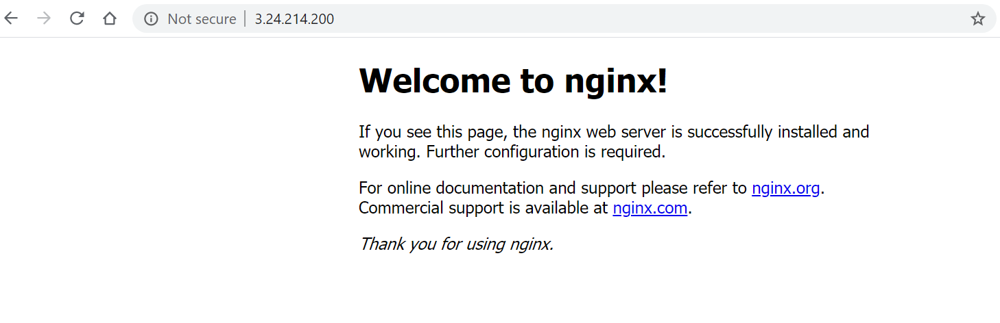

# Terraform_Docker_Framework
This is a framework for [Docker](https://www.docker.com/) is working in [Amazon AWS](https://aws.amazon.com/) cloud environment buiding by [Terraform](https://www.terraform.io/). 

## Directory Descritption
### modules: This store aws components which this framwork need by terraform codes. 
### util: Dockerfile and all script in this project, below is the detail.
- build.sh: buiding VM's envrionment, installing docker and running container.
- Dockerfile: For customize docker image
- monitor.sh: Monitoring docker container's states and resource usage
- static_words_in_home_page.sh: A simple script which can count most frequency words in the home page.

## Step Zero: Prerequisites

- This needs a [Terraform Client](https://www.terraform.io/downloads.html). You can put it into the $PATH or use specified path directly.
- This needs you to prepare a Key pair for VM's login automatically. You can put the key pair in your local host. The variables location are in modules/ec2/variables.tf. They are variable "public_key_path" and variable "private_key_path" 
- This needs you to put an aws credential to main.tf in root directory. The variable name is "shared_credentials_file=", file content format is :
```
[default]
aws_access_key_id = A1B2C3D4F5G6H7I8J9K0
aws_secret_access_key = A1B2C3D4F5G6H7I8J9K0A1B2C3D4F5G6H7I8J9K0
```

## Step One: Run Terraform
Run command under root directory:
```
$ terraform init
$ terraform apply
```
If you are using terrform running in windows, run:
```
C:\> terraform.exe init
C:\> terraform.exe apply
```
## Step Two: Check Running Result
After terraform apply running successfully, in the output you will see: EC2_IP and ELB_DNS_NAME (in this framework, it used ELB, but ELB need 1 to 2 minutes to start up after terraform run over. So we should better try EC2_IP first). 

Then Put EC2_IP or ELB_DNS_NAME into Internet Browser, you should see the Nginx Welcome Page:



##  Step Tree: The Script Output
As mentioned above, there are two functional scripts in 'util' dir. These two script would run automatically after docker environment had been built. You can check them through nginx's web service by EC2_LOG_PATH or ELB_LOG_PATH which outputed after terraform apply run over. Log page like this:


Click the monitor log it would show:


Words statistics script run like:


##  Step Tree: Trouble Shooting
Login to VM:
Check docker running status:
```
ubuntu@ip-10-0-1-185:~$ sudo docker ps
CONTAINER ID        IMAGE                COMMAND                  CREATED             STATUS                    PORTS                NAMES
f129c266fd00        nginx:my_version01   "/docker-entrypoint.…"   31 minutes ago      Up 31 minutes (healthy)   0.0.0.0:80->80/tcp   nginx01
ubuntu@ip-10-0-1-185:~$ 
```
Check if all files were uploaded to VM:
```
ubuntu@ip-10-0-1-185:~$ ls -l
total 16
-rw-r--r-- 1 ubuntu ubuntu 288 Jul 12 02:48 Dockerfile
-rw-r--r-- 1 ubuntu ubuntu 786 Jul 12 02:48 build.sh
-rw-rw-r-- 1 ubuntu ubuntu   0 Jul 12 02:50 monitor.output
-rw-r--r-- 1 ubuntu ubuntu 810 Jul 12 02:50 monitor.sh
-rw-r--r-- 1 ubuntu ubuntu 450 Jul 12 02:48 statistics_words_in_home_page.sh
ubuntu@ip-10-0-1-185:~$
```

Check monitor output log:
```
ubuntu@ip-10-0-1-185:~$ cat monitor.output 
ubuntu@ip-10-0-1-185:~$ 
```

